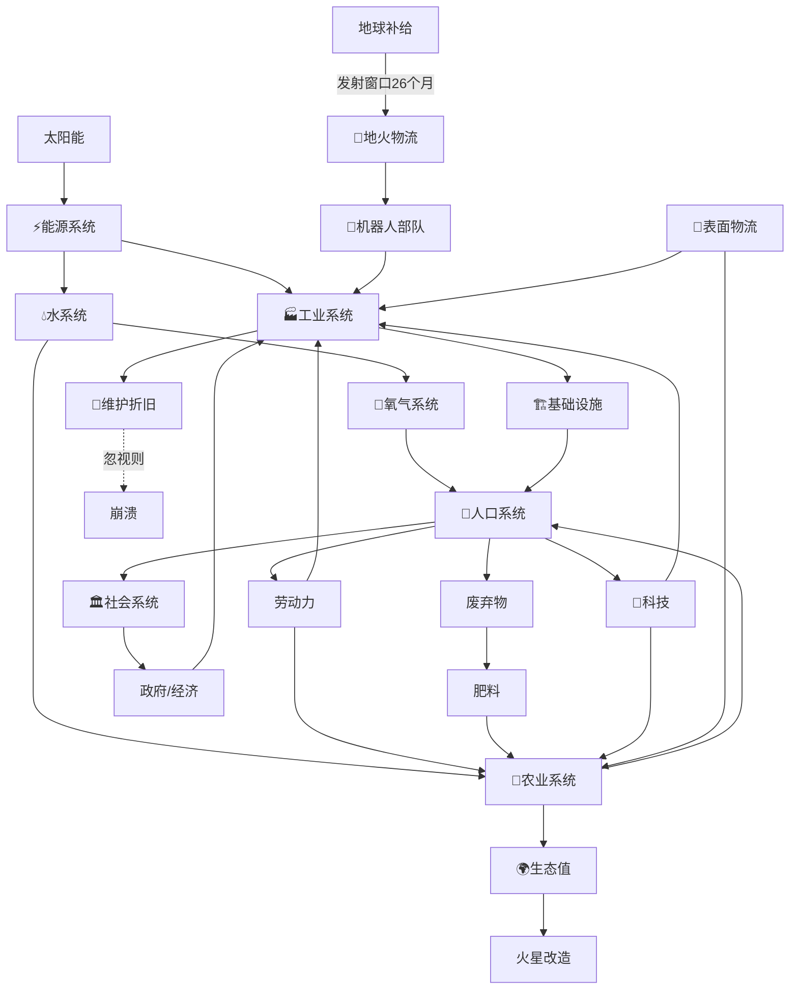

# 火星文明运行模型（宪法）V0.1

> **地位**：本文件是 Mars Genesis 项目的宪法。GDD 各卷描述"是什么、为什么"，DATA 定义"是多少"，本模型定义"为什么是这样、它们如何互相影响"。
> 任何建筑、科技、事件、AI 建议，**必须能从本模型推导出来**；推导不出来的，不许进 DATA。
>
> 项目性质：基于现实科学的**火星文明仿真平台**，不是传统娱乐游戏。目标不是通关，而是发现火星长期生存所需的条件、资源、技术、社会结构，以及问题与解决方案。

## 1. 第一性原理

**人类文明是一个资源转换网络。** 能量从太阳流入，经过层层转换，最终沉淀为文明：

```
太阳能 → 电力 → 工业 → 基础设施 → 农业 → 人口 → 科技 → 文明
```

三条硬约束（物理学，不可违反）：

1. **能量守恒**：任何转换都有损耗，效率恒小于 100%。没有免费的午餐，没有永动机。
2. **最小因子定律**（Liebig）：系统产出永远受最短板限制。10000 吨钢材救不活缺水的殖民地。
3. **熵增**：设备会折旧、建筑会老化、土壤会退化。没有维护投入，一切都在慢性崩溃。

## 2. 子系统（对应六层文明架构）

| 层 | 子系统 |
|---|---|
| 一 自然层 | 2.0 自然环境 |
| 二 资源层 | 2.1 能源、2.3 水、2.4 氧/大气、2.5 食物 |
| 三 工业层 | 2.2 物流、2.6 工业 |
| 四 生态层 | 2.8 生态系统 |
| 五 社会层 | 2.7 人口与社会 |
| 六 文明层 | 城市分区、政府/经济、火星改造 |

### 2.0 自然层（第零约束）

火星环境：温度、气压、辐射、重力、沙尘暴、地质、水冰分布。**玩家无法控制，只能适应。**

- 选址即战略：水冰分布（`planets.json`）决定基地位置——第一任务"扫描水冰"不是教学点缀，而是第一性原理。
- 辐射与气压决定一切居住建筑必须密封+屏蔽，这是"封闭基地"一代的物理根因。
- 沙尘暴是周期性冲击源（见 §7），不是随机数点缀。
- 改造纪元（era 9）逐步改写本层参数：磁场→大气→温度→水循环——地图红→绿→蓝是本层参数变化的**可视化**，不是换皮。

### 2.1 能源系统
发电（太阳能/核能/甲烷）→ 储能（电池/氢）→ 输配（微电网）。火星特性：沙尘暴可使太阳能出力暴跌 70% 并持续数周——**储能容量决定尘暴存活时间**，这是能源设计的第一公式。

### 2.2 物流系统（一切从这里开始）
两层：
- **地火物流**：发射窗口约 26 个月一次，单程 6–9 个月，运力有限。这是整个文明的"脐带"，也是最硬的约束。玩家开局第一件事不是盖房，而是**排运力计划**：第 1 批能源设备 → 第 2 批机器人 → 第 3 批工业设备 → 第 4 批殖民者。
- **火星表面物流**：矿区→工厂→仓库→建筑工地的"最后一公里"。运输能力不足，资源堆在矿区等于不存在。

### 2.3 水系统
冰矿开采 → 提取 → 分配（饮用/农业/工业/电解）→ 污水 → 净化 → 回用。
核心指标：**水闭环率** = 回用水量 / 总用水量。低于 80% 的殖民地在人口扩张时必然撞上水墙。

### 2.4 氧/大气系统
制氧（电解水/CO₂ 处理）→ 居住区消耗 → CO₂ 回收（植物/工业）。氧气是**缓冲最小**的生存资源：断氧几分钟即死人，因此氧气库存与制氧冗余度是安全红线。

### 2.5 食物与农业系统
光/水/肥/土壤 → 作物（土豆/小麦/玉米/生菜先行）→ 加工 → 消费 → 有机废弃物 → 堆肥 → 回田。
农业有**生长周期**（日级时间尺度），是响应最慢的生产环节——饥荒永远比缺电来得"突然"，因为等你发现时已经错过了播种窗口。

### 2.6 工业系统
采矿 → 冶炼 → 制造 → 建造 → **维护折旧**。关键：每台设备有寿命（`lifespan`），维护消耗零件与人力。忽视维护的殖民地，崩溃不是"会不会"而是"什么时候"。

### 2.7 人口与社会系统
人口动态：出生 / 死亡 / 移民（地火窗口限制）。
需求分层（马斯洛 on Mars）：
1. 生理：氧/水/食物/温度/防辐射
2. 安全：医疗、设备可靠、社会治安
3. 社交：家庭、朋友、社区
4. 尊重：职业、成就、地位
5. 自我实现：教育、科研、创业、信仰

只满足第 1 层，得到的是"活着"；1–2 层满足，得到"稳定"；3–5 层满足，才得到"文明"。**多数火星游戏停在第 1 层，本项目必须走到第 5 层。**

社会涌现：家庭 → 学校/企业 → 社区 → 政府。经济系统：资源不由玩家"变出来"，而经由**劳动 → 生产 → 运输 → 交易**产生；价格由稀缺度内生形成；政府通过税收/补贴做宏观调控（玩家的杠杆，不是上帝之手）。

### 2.8 生态系统
生态值量化生态健康。代际路线：封闭基地（一代）→ 生态穹顶（二代）→ 区域生态圈（三代）→ 开放生态圈（四代）→ 行星改造（五代）。每一代都是前一代的**涌现结果**，不是解锁开关。

## 3. 因果关系图



## 4. 关键反馈环

| 环 | 类型 | 描述 |
|---|---|---|
| 增长引擎 | 正反馈 | 能源↑ → 工业↑ → 更多能源设施 → 能源↑↑。起飞靠它。 |
| 生存链 | 负反馈 | 人口↑ → 需求↑ → 资源压力↑ → 短缺 → 死亡/外迁 → 人口↓。**任何一环断裂，文明崩溃。** |
| 尘暴冲击 | 冲击传导 | 尘暴 → 太阳能↓ → 储能耗尽 → 工业停摆 → 制氧/水厂停机 → 生存链断裂。**一次传导，全链目击。** |
| 生态正环 | 正反馈 | 农业↑ → 食物↑ → 人口↑ → 废弃物↑ → 肥料↑ → 农业↑↑。转起来就停不下。 |
| 慢变量杀手 | 延迟负反馈 | 辐射 → 健康↓（数年潜伏）→ 医疗需求↑ → 劳动力↓ → 维护↓ → 设备故障↑。**最危险的风险是慢的。** |
| 文明飞轮 | 正反馈 | 人口↑ → 科技↑ → 效率↑ → 盈余↑ → 生态投入↑ → 生态值↑ → 改造↑。 |

## 5. 瓶颈定律（AI 顾问的算法基础）

系统在任意时刻的产出 = **各环节容量的最小值**。

**问题发现系统 v1 算法（最小因子扫描器）**：
每 N tick，对每条生存链计算**耗尽时间**：

```
耗尽时间 = 当前库存 / max(0, 净消耗速率)
```

- 对人口增长做 5 年外推：`未来缺口 = 预测需求 - 预测供给`。
- 输出按"耗尽时间"排序的 Top 风险 + 建议动作模板：
  - "水危机：按当前人口增速，4.7 年后缺水。建议：+2 水冰开采厂 / 提升闭环率至 85%。"
  - "电力危机：30 天尘暴下储能仅支撑 11 天。建议：+20MW 光伏 / +4000kWh 储能。"
- **AI 是顾问，不是作弊器**：它只给预测和建议，资源还是要玩家自己去建。

## 6. 时间尺度（多速率仿真）

| 步长 | 层级 | 内容 |
|---|---|---|
| 秒 | ⚡瞬时 | 电力供需平衡（eff 系数） |
| 分 | 🏭生产 | 采集/制造/运输/建造 |
| 时/日 | 🌾生物 | 作物生长、水净化、废弃物处理 |
| 月 | 👥人口 | 出生/死亡/移民、就业 |
| 年 | 🏛社会 | 教育产出、经济周期、政策效果 |
| 十年 | 🌍行星 | 大气增厚、生态扩张 |

慢层给快层定约束（人口定食物需求），快层给慢层交账本（年度盈余决定能否扩张）。**跨尺度传导是仿真真实感的来源。**

## 7. 冲击与韧性

冲击是必然的，设计目标是**韧性**不是**避免**：

```
韧性 = 缓冲（库存/冗余产能）× 多样性（多能源/多水源）× 恢复力（维修速度/机器人）
```

冲击表（事件表的数据来源）：沙尘暴、太阳耀斑、陨石、设备故障、传染病、辐射泄漏、**供应链中断**（地球端发射失败——脐带被掐住时，殖民地能撑多久？这是终极考题）。

## 8. 宪法级不变量（任何内容不得违反）

1. **能量守恒**：转换必有损耗，无免费资源。
2. **最小因子**：产出受最短板限制，补短板优先于堆长板。
3. **物流先行**：没有运力就没有物资；地火 26 个月窗口是硬约束。
4. **闭环率决定可持续性**：水/氧/食物回用率是长期生存的第一指标。
5. **需求是分层的**：只满足生理层，社会停滞；满足五层，才是文明。
6. **设备会折旧**：维护是经常性支出，不是可选项。
7. **冲击必然发生**：为韧性设计，不为无事故设计。
8. **AI 只建议、不执行**：保持玩家的决策主体性（教学与发现之用）。

## 9. 与 DATA 的映射

| 模型子系统 | DATA 表 | 待补字段（v0.2） |
|---|---|---|
| 自然层 | planets.json ✅ | 改造纪元改写参数（v0.5） |
| 能源/水/氧/食物 | resources.json buildings.json | `lifespan`（设备寿命）、`recycle_rate`（回用率） |
| 地火物流 | logistics.json ✅ | 发射窗口倒计时 UI（v0.2） |
| 表面物流 | buildings.json | 运输建筑 `throughput`（吞吐量/分钟） |
| 工业折旧 | buildings.json | `lifespan`、`maintenance{}` |
| 人口社会 | citizens.json | 需求分层字段、家庭/企业结构（卷五） |
| 问题发现 | events.json | `trigger` 扩展：支持"耗尽时间<阈值"型触发 |
| AI 顾问 | （新模块） | `game/js/advisor.js`：最小因子扫描器 |

## 10. MVP 子集（v0.2 先实现）

1. 能源/水/氧/食物四链进 DATA（已就位 23 条 mvp 资源）。
2. **最小因子扫描器 v1**：耗尽时间排序 + 三类危机预警（水/电/食物）。
3. **地火物流简化版**：发射窗口倒计时 + 批次货运清单（第1批能源→第2批机器人→第3批工业→第4批殖民者）。
4. 设备折旧 `lifespan` 字段进 schema（数值可先保守）。

## 附：项目总纲（Muse 持有）

> Create a scientifically grounded Mars Civilization Simulation Platform.
> This is not an entertainment-focused game. The purpose is to simulate the complete
> process of establishing a sustainable human civilization on Mars.
> The simulation begins with unmanned Starship cargo missions delivering robots,
> energy systems, industrial equipment, and construction tools. Humans arrive only
> after basic infrastructure has been established.
> The simulation must model: Physics, Energy, Water, Oxygen, Food, Industry,
> Transportation, Logistics, Economics, Population, Education, Healthcare,
> Government, Ecology, Terraforming. All systems should interact realistically.
> The platform should continuously identify bottlenecks, risks, and future resource
> shortages. The goal is to discover what is required for long-term human survival
> and civilization growth on Mars, and to evaluate solutions through simulation.
> The final stage is a self-sustaining Martian ecological civilization capable of
> independent growth without Earth support.

---

*宪法 V0.1，2026-10-01。依据 Zhang 九原则制定。修订需经 Zhang 确认——宪法不随意改。*
